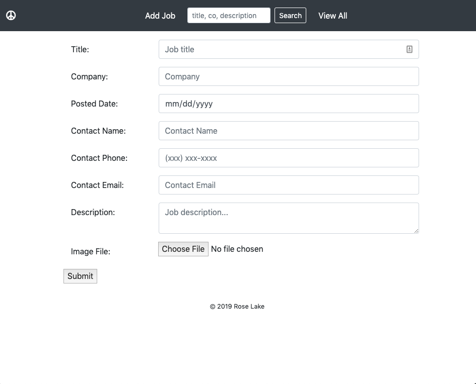

# Job Board

The home page lists all of the currently posted jobs. 

The application is responsive. 

Each job is displayed in a Bootstrap card with an optional image included above the information. 

The search capability allows searching by full or partial words that are found in the Job's title, company, or description. 

This is a CRUD implementation using an h2 databse. It can be changed over to use mysql, as well.

Any user can... 
- view the details of a job posting

- delete any existing job posting.
- edit the specifics of an existing job posting.

- or create a new job posting...

