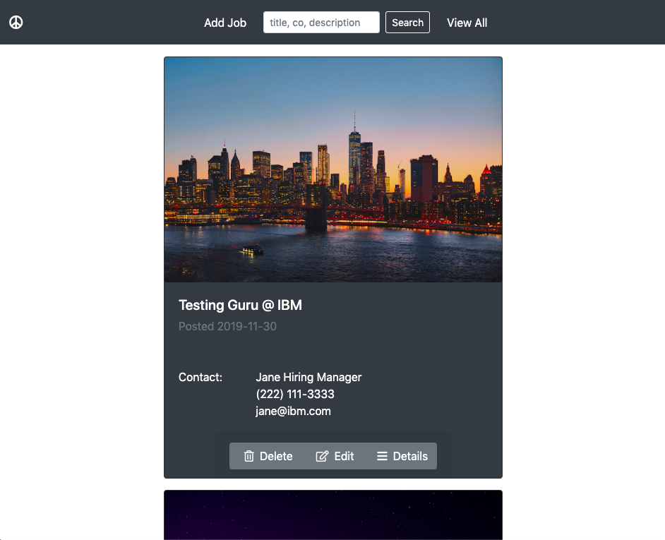
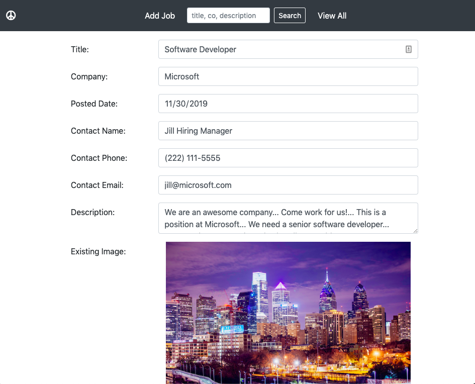

# Job Board

The home page lists all of the currently posted jobs. 

The search capability allows searching by full or partial words that are found in the Job's title, company, or description. 

Any user can... 

- view the details of a job posting

- delete any existing job posting.

- edit the specifics of an existing job posting.

- create a new job posting.

The application uses Bootstrap and is responsive. 

This CRUD implementation uses an h2 databse and is set up to be easily changed over to use mysql, as well. 
